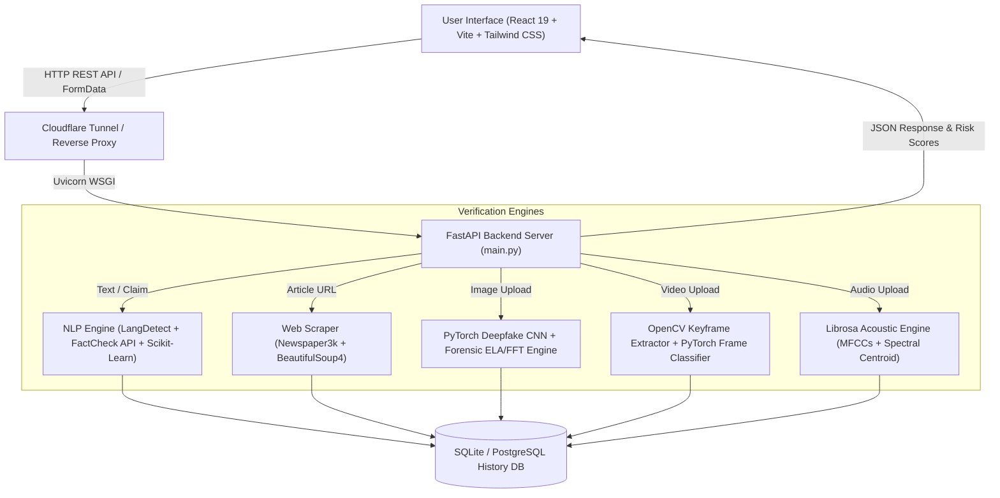

# 🛡️ FakeBuster AI – Multimodal Misinformation & Deepfake Verification Engine

[](https://fakenewsmini-fakebuster.surge.sh/)
[](https://github.com/Vysh2205/FakeNewsMini)
[](https://fastapi.tiangolo.com/)
[](https://react.dev/)

**FakeBuster AI** is an end-to-end, real-time multimodal verification platform designed to detect news text manipulation, misleading URLs, visual image deepfakes, manipulated video recordings, and synthetic audio deepfakes.

Built with a high-performance **FastAPI** backend, **PyTorch 2.12** deep learning model inference engines, and a modern **React 19 + Tailwind CSS** glassmorphism frontend interface.

---

## 🌐 Live Application & Repositories

* **Production Live Web App**: [https://fakenewsmini-fakebuster.surge.sh/](https://fakenewsmini-fakebuster.surge.sh/)
* **GitHub Code Repository**: [https://github.com/Vysh2205/FakeNewsMini](https://github.com/Vysh2205/FakeNewsMini)

---

## ✨ Key Features & Capabilities

### 1. 📄 Text & Claim Verification
* **Multilingual Input Support**: Real-time verification for claims in **English**, **Hindi (हिंदी)**, and **Telugu (తెలుగు)** with auto-translation and language detection (`langdetect`, `deep-translator`).
* **Automated Claim Extraction**: Uses NLP heuristics to extract atomic factual statements and entities from input articles.
* **Fact-Check API Integration**: Integrates Google Fact Check Tools API and live web evidence retrieval to aggregate independent verification claims.

### 2. 🔗 Article URL Web Scraper
* Automatically parses article content, headlines, publish dates, and metadata from news URLs using `newspaper3k` and `BeautifulSoup4`.
* Evaluates domain credibility, domain age, and historical trust scores.

### 3. 📷 PyTorch Image Deepfake Verification
* **PyTorch CNN Classifier**: Deep Convolutional Neural Network (`DeepfakeCNNClassifier`) evaluating spatial feature representations.
* **Digital Image Forensics Engine**:
  * **Error Level Analysis (ELA)**: Detects compression loss variance across JPEG/PNG quantization grids.
  * **2D Fast Fourier Transform (FFT)**: Identifies high-frequency spectral grid artifacts left by generative diffusion models or GANs.
  * **Spatial Grain / Laplacian Variance**: Measures lens blur, skin smoothing, and focus gradients.
* **Honest Decision Boundaries**: Classifies uploaded images as `Likely Authentic Image` (`REAL`), `Manipulated / AI-Generated Image Detected` (`FAKE`), or `Image Verification Inconclusive` (`UNCERTAIN`).

### 4. 🎬 Video Deepfake Verification Engine
* **OpenCV Timeline Keyframe Extractor**: Dynamically extracts representative timeline keyframes, resolution metadata, frame counts, and FPS from MP4, MOV, and AVI videos.
* **PyTorch 3D-CNN Frame Analysis**: Computes per-frame neural probabilities and evaluates temporal inter-frame variances.
* **Verdict Categories**: Returns `Likely Authentic Video` (`REAL`), `Manipulated / AI-Generated Video Detected` (`FAKE`), or `Video Verification Inconclusive` (`UNCERTAIN`).

### 5. 🎙️ Audio Deepfake & Voice Analysis
* **Acoustic Feature Extraction**: Extracts Mel-Frequency Cepstral Coefficients (MFCCs), spectral centroid, pitch variance, and zero-crossing rates using `librosa`.
* Detects synthetic text-to-speech (TTS), voice cloning, and audio deepfakes in MP3, WAV, M4A, and AAC formats.

### 6. 📊 Analytics, History & PDF Report Export
* **Verification History**: Persistent SQL database (`SQLite` / `PostgreSQL`) storing all past analysis sessions.
* **Interactive Dashboard**: Visual breakdown of total verifications, risk distributions, and modality statistics.
* **PDF Report Generator**: One-click Client-side PDF export with extracted claims, confidence scores, and forensic indicators using `jsPDF`.

---

## 🏗️ System Architecture



---

## 🛠️ Technology Stack

### Backend Technologies
* **Language & Framework**: Python 3.12, FastAPI, Uvicorn
* **Deep Learning & ML**: PyTorch 2.12, torchvision, Scikit-Learn, NumPy, SciPy
* **Computer Vision & Image Processing**: OpenCV (`opencv-python-headless`), Pillow (PIL), PyTesseract
* **Audio Processing**: Librosa, SoundFile, PyDub
* **NLP & Web Scraping**: Newspaper3k, BeautifulSoup4, LangDetect, Deep-Translator
* **Database & ORM**: SQLAlchemy, SQLite, PostgreSQL (`psycopg2-binary`)

### Frontend Technologies
* **Core Library**: React 19, TypeScript
* **Build System**: Vite 8, Rolldown
* **Styling**: Tailwind CSS 3.4, PostCSS, Autoprefixer
* **Animations & Icons**: Framer Motion 12, Lucide React
* **Document Export**: jsPDF 4

### Deployment & Infrastructure
* **Frontend Hosting**: Surge.sh (`fakenewsmini-fakebuster.surge.sh`)
* **Tunneling & SSL**: Cloudflare Tunnels (`cloudflared`)

---

## 🔌 API Endpoints Reference

| Endpoint | Method | Request Body | Description |
| :--- | :--- | :--- | :--- |
| `/api/verify/text` | `POST` | `{"text": "claim string"}` | Verifies text claims, performs translation, extracts claims, queries fact check databases. |
| `/api/verify/url` | `POST` | `{"url": "https://..."}` | Scrapes news article from URL, evaluates domain credibility, runs NLP analysis. |
| `/api/verify/image` | `POST` | `FormData (file)` | Runs PyTorch CNN & forensic ELA/FFT analysis on uploaded JPEG/PNG/WEBP images. |
| `/api/verify/video` | `POST` | `FormData (file)` | Extracts keyframes via OpenCV and computes frame-by-frame PyTorch CNN probabilities on MP4/MOV/AVI. |
| `/api/verify/audio` | `POST` | `FormData (file)` | Extracts MFCC acoustic features using Librosa and classifies voice synthetic deepfakes. |
| `/api/analytics` | `GET` | None | Returns aggregated verification statistics and risk level distributions. |
| `/api/history` | `GET` | None | Retrieves persistent verification logs from the database. |

---

## 💻 Local Setup & Installation Guide

### Prerequisites
* **Python**: `3.10+` (Recommended: Python 3.12 or Anaconda Python)
* **Node.js**: `v18.0+` or `v20.0+`
* **Git**

### 1. Clone the Repository
```bash
git clone https://github.com/Vysh2205/FakeNewsMini.git
cd FakeNewsMini
```

### 2. Backend Setup
```bash
# Navigate to backend directory
cd backend

# Install Python dependencies
pip install -r requirements.txt

# (Optional) Generate PyTorch Model Checkpoint
python train_image_cnn.py

# Start FastAPI server on port 8000
python -m uvicorn main:app --host 127.0.0.1 --port 8000 --reload
```

### 3. Frontend Setup
```bash
# Open a new terminal and navigate to frontend directory
cd frontend

# Install Node modules
npm install

# Start Vite development server
npm run dev
```
Open `http://localhost:5173` in your browser.

---

## 🚀 Deployment Guide

### Deploying Frontend to Surge.sh
```bash
cd frontend
npm run build
npx surge dist fakenewsmini-fakebuster.surge.sh
```

### Running Cloudflare Tunnel for Backend
```bash
cloudflared.exe tunnel --url http://127.0.0.1:8000
```

---

## 📄 License & Attribution

This project is open-source under the **MIT License**.

Developed for real-time multimodal misinformation detection and deepfake research.
* **Author**: [Vyshnav](https://github.com/Vysh2205)
* **Repository**: [https://github.com/Vysh2205/FakeNewsMini](https://github.com/Vysh2205/FakeNewsMini)
